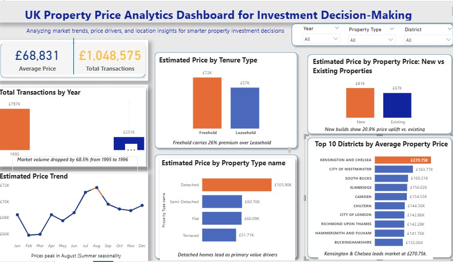

# UK Real Estate Market Intelligence Dashboard

## Overview

This project presents an interactive Power BI dashboard designed to analyze UK property market trends and support investment decision-making. The dashboard provides insights into pricing patterns, transaction activity, property types, tenure categories, and district-level performance.

---

## Problem

Property investors and stakeholders need a clear understanding of market trends, pricing behavior, and regional opportunities to make informed investment decisions.

---

## Project Objective

To build an interactive business intelligence dashboard that enables users to explore UK property market performance and identify key investment opportunities.

---

## Dashboard Preview

---

## What I Did

- Cleaned and prepared UK property market data
- Designed an interactive Power BI dashboard
- Implemented filters for Year, Property Type, and District
- Built KPI cards to track Average Price and Total Transactions
- Created visualizations for pricing trends and market comparisons
- Analyzed property performance across districts and tenure types

---

## Key Dashboard Features

### KPI Monitoring
- Average Property Price
- Total Transactions

### Trend Analysis
- Property price trends over time
- Transaction volume analysis

### Market Comparison
- Property Type comparison
- Tenure Type comparison
- New vs Existing property pricing

### Geographic Insights
- Top-performing districts by average property price

---

## Key Insights

- Kensington & Chelsea recorded the highest average property prices.
- Freehold properties achieved higher estimated prices than leasehold properties.
- Detached properties outperformed other property types in average value.
- New-build properties showed higher estimated prices than existing properties.
- Property prices demonstrated noticeable variation across districts.

---

## Tools Used

- Power BI
- Data Cleaning
- Data Visualization
- Business Intelligence Analysis

---

## Files Included

- dashboard task fixed.pbix
- README.md
- dashboard-overview.png

---

## Author

**Emmanuella Alao**

Data Analytics | Business Intelligence | Data Visualization
